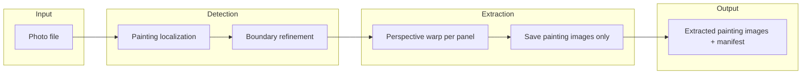

# Painting retrieval — architecture

## Objective

Accurately retrieve only the painting image(s) from photos. Inputs are real-world photos where paintings appear on walls, floors, carpets, or cluttered drop cloths; outputs are only the painting image(s)—single canvas, diptych, multi-panel grid, or irregular multi-panel—with no background (wall/floor/supplies).

## Pipeline

- **Stage 1 – Painting localization**: Decide what is “painting” vs “not painting” (wall, floor, carpet, drop cloth, palette, brushes). Output: one or more candidate regions (per canvas/panel).
- **Stage 2 – Boundary refinement**: For each region, get precise quad (4 corners) for perspective correction; iterative vision (e.g. 5 passes) refines corners.
- **Stage 3 – Extraction**: Warp each quad to a rectangle and save only those images (no background).

## File system

| Path | Purpose |
|------|--------|
| `data/inputs/` | Ingested photos (uploaded or copied); single source of truth for input images. |
| `data/extractions/<source_id>/` | Per-source extraction: `manifest.json`, `overlay.png`, `painting_0.png`, `painting_1.png`, … |
| `data/runs/<source_id>/<run_id>/` | Detection runs: `manifest.json`, `overlay.png`, `original.<ext>`, refinement notes. |
| `outputs/<stem>/` | Section-split export: `manifest.json`, `section-0.png`, … `composite.png`, `composite-recreated.png`. See [FILE-NAMING.md](FILE-NAMING.md) and [MANIFEST.md](MANIFEST.md). |

**Manifests:**
- **Extraction** (`data/extractions/`): `source_path`, `source_width`, `source_height`, `paintings[]` with `filename`, `bounds`, `corners`, optional `rotation_degrees`.
- **Split** (`outputs/<stem>/manifest.json`): Full schema for reconstruction — source dimensions, sections (bounds/corners, orientation, layout), composite filenames. See [MANIFEST.md](MANIFEST.md) for how to read it and place sections.

## Components

- **Core** (`core/`): Image load/save, coordinate types (rect, quad), crop, perspective warp. No AI, no HTTP. Used by detection and extraction.
- **Detection** (`detection/`): Painting localization + boundary refinement. Vision client, “painting only” prompts, iterative refinement. Input: image path; output: list of quads.
- **Extraction** (`extraction/`): Takes image path + list of quads; warps each to a rectangle; writes painting images + manifest into `data/extractions/<source_id>/`. Uses Core for all image ops.
- **API** (`app.py`): Flask routes for list/upload inputs, retrieve-paintings (detection + extraction), list/serve extractions, runs, split/outputs and recreate. No direct image logic.
- **Image processor** (`image_processor.py`): Split by rects or quads; writes `manifest.json`, section images, and composites under `outputs/<stem>/`. See [FILE-NAMING.md](FILE-NAMING.md) and [MANIFEST.md](MANIFEST.md).
- **Web** (`static/index.html`): Single-page flow: select/upload photo → “Retrieve paintings” → view/download extracted painting images. Optional: legacy Auto-detect and export sections.
- **CLI/scripts** (`scripts/`): `retrieve_one.py` (single image, optional sections JSON), `retrieve_paintings_batch.py` (all images in data/inputs/), `split_from_sections.py` (rects or quads to output dir).

## Detection strategy

- **Vision model (primary)**: OpenAI vision with prompts that explicitly require “identify only the painting(s); exclude wall, floor, carpet, drop cloth, furniture, art supplies.”
- **Iterative refinement**: Multiple passes (default 5) to refine corner positions for perspective correction.
- **Fallback**: If the model returns no sections or clearly wrong result, the app returns “no painting found” instead of exporting background.

## API

| Endpoint | Description |
|----------|-------------|
| `GET /api/inputs` | List image files in data/inputs/. |
| `POST /api/inputs` | Upload image to data/inputs/. |
| `GET /api/inputs/<filename>` | Serve image from data/inputs/. |
| `POST /api/retrieve-paintings` | Run detection + extraction; body `{ "path": "inputs/foo.jpg" }`. Returns `source_id`, `paintings[]`, `manifest_url`. |
| `POST /api/retrieve-paintings-stream` | Same as above, NDJSON stream (progress + extraction_done). |
| `GET /api/extractions` | List extraction dirs (source_id, paintings_count). |
| `GET /api/extractions/<source_id>/<filename>` | Serve painting image or manifest.json. |
| `GET /api/runs` | List detection runs. |
| `GET /api/runs/<stem>/<run_id>/...` | Manifest, overlay, original for a run. |
| `POST /api/split` | Split image into sections (rects or quads); writes to `outputs/<stem>/`. |
| `GET /api/outputs` | List split outputs (paths to `manifest.json` per folder). |
| `POST /api/outputs/recreate` | Recreate composites from `manifest.json` (body: `{ "path": "folder/manifest.json" }`). |
| `GET /api/outputs/<path>` | Serve file from outputs/ (e.g. `stem/section-0.png`). |

## Dependencies

- **Required**: numpy, opencv-python-headless, Pillow, scikit-image, flask, werkzeug, openai, pyyaml.
- **Optional**: pillow-heif (HEIC); dev: pytest.
